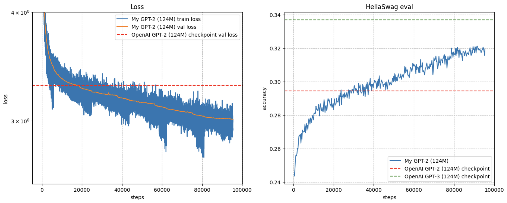

# GPT-2 Implementation in PyTorch

This project reproduces the GPT-2 model in pytorch and trains it from scratch on the FineWeb-Edu dataset - a high-quality subset of FineWeb dataset tailored for educational content. The goal is to offer a simplified, easy-to-understand PyTorch implementation. Note that this code is intended primarily for educational purposes and is not optimized for speed or production deployment.

### Key Features
- **Simplified PyTorch Implementation:** Designed to be accessible and well-commented for ease of understanding.
- **Customizable Training:** Hyperparameters are configurable via the command line and can be easily modified.
- **Multi-GPU Training Support:** Training can be performed using multiple GPUs using PyTorch Distributed Data Parallel (DDP).


## Repository Structure
- `src/train.py`: Script to train the GPT-2 model with customizable configurations.
- `src/model.py`: Contains the GPT-2 model implementation, including embedding layers, transformer blocks, and output layers.
- `src/dataloader.py`:  Handles data loading and batching for the model during training.
- `src/prepare_dataset.py`: Downloads and preprocesses the FineWebEdu dataset. Run this script before starting the training process.
- `requirements.txt`: Python dependencies required to run the project.


## Getting Started

### Prerequisites
Ensure you have the following dependencies installed:

- numpy
- pytorch
- tiktoken
- transformers (from huggingface)

You can install all dependencies with:
```bash
pip install -r requirements.txt
```

## Dataset

The GPT-2 model was originally trained on the WebText dataset (not publicly released). For this project, we use the FineWebEdu-10B dataset—a specialized educational subset of the FineWeb dataset. It contains approximately 10 billion tokens focused on high-quality educational content.

To download and prepare the dataset:
```bash
python prepare_dataset.py
```

### Running the Training Script
You can start training the GPT-2 model using the following commands:

You can experiment with different training and model config hyperparameters by setting them through the command line. 

- Single-GPU Training:
```bash
python train.py --num_epochs=5
```

- Multi-GPU Training (uses Pytorch DDP):
```bash
torchrun --standalone --nproc_per_node=4 train.py    # adjust number of GPUs as per availability
```

For more details on the training process and customizing hyperparameters, refer to the `src/train.py` script.

Training was performed from scratch using multiple GPUs with PyTorch's DDP framework.


After training the model, you can generate text based on custom prompts. Use the `src/inference.py` script to interact with the trained model and generate creative continuations.

Run the inference script from the command line with the following syntax:
```bash
python3 inference.py --prompt="I am a AI and robotics enthusiast, I want to" --max_tokens=50 --num_seq=5
```

This command will output 5 unique text sequences, each starting with the provided prompt and continuing for up to 50 tokens.


### Model Architecture
The GPT-2 model consists of the following components:

- **Token Embedding Layer:** Encodes input tokens to dense vectors.
- **Positional Embedding Layer:** Adds positional information to the token embeddings.
- **Transformer Blocks:** Each block includes layer normalization, multi-headed self-attention, and an MLP with residual connections.
- **Output Head:** Predicts the next token in the sequence based on the preceding context.

The model is trained to predict the next token in a sequence, enabling coherent text generation. For token generation, I have used huggingface `tiktoken` library that generates 50,257 tokens (same as GPT-2). 


### Results

The GPT-2 model was trained for roughly 95,365 steps (5 epochs) using two NVIDIA A100 GPUs. Training took approximately 46 hours.



To generate from the trained model, we provide an input prompt sequence, and ask the model to generate the next N tokens. Here are some samples of text generated by the trained model: 

- **prompt text:** "Hello, I am a language model"
- **Model output:**
```
- Hello, I am a language modeler. I use the API, in whatever language I require it to write out. On first, I define a model for

- Hello, I am a language model expert and need help with building these model. The project is designed in C++ and the Python library is used. The project

- Hello, I am a language model developer at Google Cloud. It has great features on most platforms which makes it one of most popular. It also integrates with third
```

- **prompt text:** "I am a machine learning and robotics enthusiast, and I want to"
- **Model output:**
```
- I am a machine learning and robotics enthusiast, and I want to share my excitement about this work as soon as possible.
The purpose of this project was to help the engineers and programmers understand how the HURD and AVR circuits work and how

- I am a machine learning and robotics enthusiast, and I want to try and train a new machine learning-based system such as a deep learning algorithm that is completely new to me.

- I am a machine learning and robotics enthusiast, and I want to help you by helping you improve your Python programming skills.To understand the concept of machine learning, you must understand the concept of a machine learning model. Machine learning models

- I am a machine learning and robotics enthusiast, and I want to be a part of the team.<|endoftext|>In your next project, you need to gather some interesting information from your team team. This data will help form a map that you can use to

- I am a machine learning and robotics enthusiast, and I want to create a new, more sophisticated machine learning-based library for programming languages. To start, I am interested in the machine learning (ML) capabilities of new AI methods and techniques.
```


## Potential Future Work

1. **Dataset Shuffling:** The current training code does not shuffle the dataset after each epoch. Implementing dataset shuffling between epochs could improve the model's ability to generalize and prevent overfitting to the order of the training data.

2. **Extended Training:** Experiment with training the model for more epochs to potentially improve performance. Monitor validation loss to determine the optimal number of epochs and implement early stopping if necessary.


## References:
- [Language Models are Unsupervised Multitask Learners (GPT-2 Paper)](https://cdn.openai.com/better-language-models/language_models_are_unsupervised_multitask_learners.pdf)
- [GPT-3 Paper: Language Models are Few-Shot Learners](https://arxiv.org/abs/2005.14165)
- [FineWebEdu-10B Dataset](https://huggingface.co/datasets/HuggingFaceFW/fineweb-edu)
- [FlashAttention: Fast and Memory-Efficient Exact Attention with IO-Awareness](https://arxiv.org/abs/2205.14135)
- [Attention is all you need](https://arxiv.org/abs/1706.03762)
- [HellaSwag: Can a Machine Really Finish Your Sentence?](https://arxiv.org/abs/1905.07830)
- Andrej Karpathy's Video Tutorial on GPT


## Acknowledgments
This implementation is inspired by Andrej Karpathy’s tutorial and his approach to making complex AI concepts more accessible.